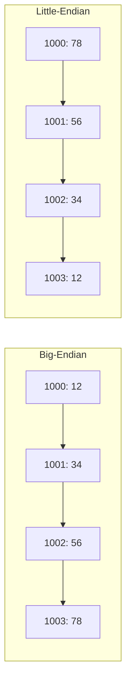
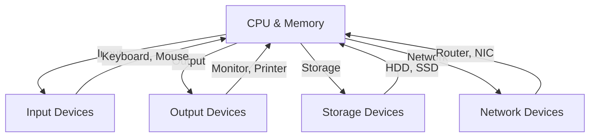
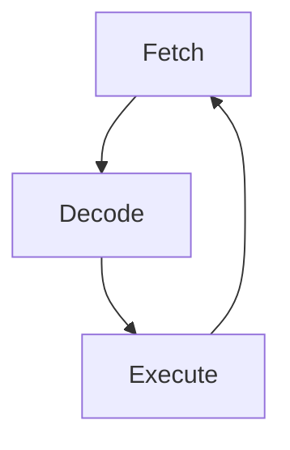

# 🧠 Lecture: Data Representation and Computer Organization

## 📘 Topics Covered
1. Big-Endian and Little-Endian Memory Organization  
2. Computer Peripherals  
3. Introduction to Von Neumann SISD Organization  

---

## 🧩 1. Big-Endian and Little-Endian Organization

### 🧠 Concept Overview
Computers store data in memory as **bytes**.  
For multi-byte data (e.g., 16-bit, 32-bit, 64-bit integers), the **order** in which bytes are stored in memory differs between systems — known as **Endianness**.

---

### 🔹 Definitions

- **Big-Endian:** The **most significant byte (MSB)** is stored at the **lowest memory address**.  
- **Little-Endian:** The **least significant byte (LSB)** is stored at the **lowest memory address**.

---

### 🧮 Example

Let’s store a 32-bit hexadecimal number: `0x12345678`

#### In Big-Endian:
| Byte | Value | Memory Address |
|------|--------|----------------|
| MSB  | 12     | 1000 |
|      | 34     | 1001 |
|      | 56     | 1002 |
| LSB  | 78     | 1003 |

#### In Little-Endian:
| Byte | Value | Memory Address |
|------|--------|----------------|
| LSB  | 78     | 1000 |
|      | 56     | 1001 |
|      | 34     | 1002 |
| MSB  | 12     | 1003 |

---

### 🖼️ Visualization



---

### 💻 C Example to Detect Endianness
```c
#include <stdio.h>
int main() {
    unsigned int x = 0x12345678;
    unsigned char *ptr = (unsigned char*)&x;
    if (*ptr == 0x78)
        printf("This system is Little Endian\n");
    else
        printf("This system is Big Endian\n");
    return 0;
}
```

---

### 🧠 Key Differences
| Feature | Big-Endian | Little-Endian |
|----------|-------------|---------------|
| Lowest address holds | MSB | LSB |
| Used by | Motorola, IBM, SPARC | Intel x86, AMD |
| Human readability | Matches number representation | Reverse order |
| Network byte order | Default | Needs conversion |

---

### 💡 Analogy
Think of a 4-digit number **1234**:
- Big-Endian → Written as **1234** (MSB first)
- Little-Endian → Written as **4321** (LSB first)

---

## 🖥️ 2. Computer Peripherals

### 🧠 Definition
**Peripherals** are external or auxiliary devices that provide **input, output, storage, or communication** capabilities.  
They are connected via I/O interfaces and enhance the computer’s usability.

---

### 🔸 Classification of Peripherals
| Type | Function | Examples |
|------|-----------|-----------|
| Input Devices | Feed data to computer | Keyboard, Mouse, Scanner |
| Output Devices | Display or output data | Monitor, Printer, Speaker |
| Storage Devices | Store data permanently | HDD, SSD, USB |
| Communication Devices | Data transfer | Modem, Router, NIC |

---

### 🖼️ Peripheral Connectivity Diagram


---

### 🔹 Functions
#### 🧮 Input Devices
- Keyboard: Generates scan codes for keypresses  
- Mouse: Converts motion into cursor movement  
- Scanner: Converts images into digital format  

#### 🖨️ Output Devices
- Monitor: Displays visual information  
- Printer: Produces hard copies  
- Speaker: Generates sound output  

#### 💾 Storage Devices
- Primary: RAM, Cache  
- Secondary: Hard Drives, SSD  
- Tertiary: Optical Discs, Tape Drives  

#### 🌐 Communication Devices
- Modem: Modulates/demodulates signals  
- NIC: Network Interface Card for data exchange  
- Router: Connects and routes between networks  

---

### ⚙️ I/O Communication Techniques
| Method | Description | Example |
|--------|-------------|----------|
| Programmed I/O | CPU polls device until ready | Simple microcontrollers |
| Interrupt-driven I/O | Device signals CPU when ready | Keyboard, Mouse |
| DMA | Device transfers data directly to memory | Disk, GPU |

---

### 💡 Peripheral Interface Concepts
- **Port:** Physical or logical connection point (USB, HDMI, etc.)  
- **Device Driver:** Software that enables OS-device communication  
- **Controller:** Hardware managing communication between device & CPU  

---

### 🧠 Example: Keyboard Input Flow
1. Key pressed → Encoder generates scan code  
2. Signal sent to I/O controller  
3. Controller triggers interrupt  
4. CPU reads data from buffer  
5. OS interprets and displays character  

---

## 🧮 3. Von Neumann SISD Organization

### 🧠 Background
Proposed by **John von Neumann in 1945**, this architecture forms the basis of most modern computing systems.

---

### 🔹 Key Concept
A **single memory** holds **both instructions and data**.  
Processing occurs **sequentially** — one instruction operates on one data element at a time.

---

### 🔸 Main Characteristics
| Feature | Description |
|----------|-------------|
| Memory | Common for program and data |
| ALU | Performs arithmetic/logic operations |
| Control Unit | Fetches, decodes, and executes instructions |
| I/O | Interfaces for input and output |
| Flynn’s Category | SISD (Single Instruction, Single Data) |

---

### 🖼️ Von Neumann Architecture Diagram
```mermaid
graph LR
  INP[Input Devices] --> CU[Control Unit]
  CU --> MEM[Memory (Instructions + Data)]
  MEM --> ALU[Arithmetic Logic Unit]
  ALU --> OUT[Output Devices]
  CU --> ALU
  ALU --> CU
```

---

### 🔹 Component Descriptions
| Component | Function |
|------------|-----------|
| Memory | Stores data and program instructions |
| Control Unit | Fetches and decodes instructions |
| ALU | Executes arithmetic and logic operations |
| Registers | Temporary storage during execution |
| I/O Interface | Handles external device communication |

---

### 🔹 Fetch-Decode-Execute Cycle
$$
\text{Instruction Cycle} = \text{Fetch} \rightarrow \text{Decode} \rightarrow \text{Execute}
$$

#### Steps:
1. **Fetch:** Get instruction from memory.  
2. **Decode:** Interpret operation and operands.  
3. **Execute:** Perform the operation and store the result.

---

### 🖼️ Instruction Cycle Diagram


---

### 🔹 SISD Explanation
| Aspect | Description |
|--------|--------------|
| Instruction Stream | Single instruction executed at a time |
| Data Stream | Operates on one data item |
| Example | Intel 8086, early microprocessors |

---

### 🧮 Example Assembly Code
```assembly
LOAD R1, A
LOAD R2, B
ADD R3, R1, R2
STORE R3, C
```
Each instruction executed sequentially by a single processor.

---

### ⚠️ Von Neumann Bottleneck
- **Issue:** Data and instructions share a single memory and bus.  
- **Result:** CPU stalls waiting for memory access.  
- **Impact:** Limits instruction throughput and system performance.

---

### 🔹 Flynn’s Taxonomy Comparison
| Category | Instruction Stream | Data Stream | Example |
|-----------|--------------------|-------------|----------|
| SISD | Single | Single | Intel 8086 |
| SIMD | Single | Multiple | GPUs |
| MISD | Multiple | Single | Pipeline processors |
| MIMD | Multiple | Multiple | Multicore CPUs, clusters |

---

## 🧾 Summary Table
| Topic | Key Idea |
|--------|-----------|
| Big/Little Endian | Defines byte order for multi-byte data |
| Peripherals | Input, output, storage, communication devices |
| Von Neumann SISD | Single memory and sequential execution model |

---

## 🧠 Quick Quiz
1. What is the main difference between Big-Endian and Little-Endian?  
2. List three types of peripherals and their functions.  
3. What are the main components of the Von Neumann architecture?  
4. Explain the Von Neumann bottleneck.  
5. What does SISD stand for?  

---

## 📚 References
- Patterson & Hennessy, *Computer Organization and Design*  
- Stallings, *Computer Organization and Architecture*  
- Tanenbaum, *Structured Computer Organization*  
- Flynn, M. J. (1972). *Some Computer Organizations and Their Effectiveness.*
