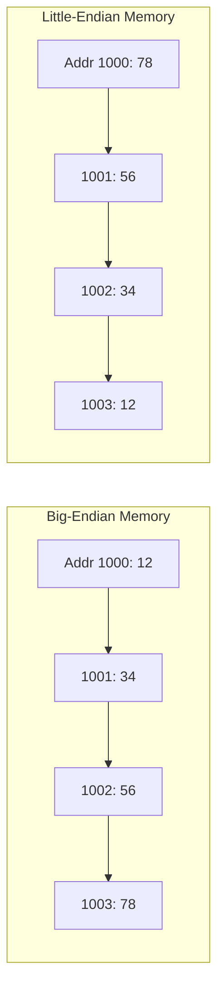
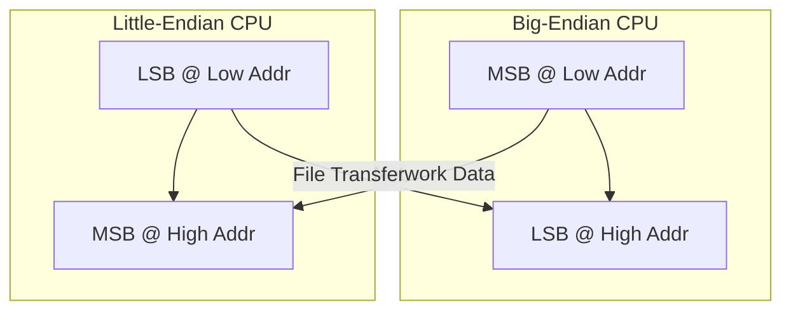

# 🧠 Big-Endian and Little-Endian Organization
### Course: Computer Architecture  
**Duration:** ~30 Minutes  
**Instructor:** Md. Jahidul Islam  

---

## 🎯 Learning Objectives
By the end of this lecture, you will be able to:

- Explain what **Endianness** means in computer memory systems  
- Differentiate between **Big-Endian** and **Little-Endian** data representations  
- Illustrate byte ordering using diagrams  
- Convert multi-byte data between endianness formats  
- Identify real-world examples and use cases  

---

## 🧩 What is Endianness?
Endianness defines **how multi-byte data** (e.g., 16-bit, 32-bit, 64-bit values) are **stored in memory**.

> It determines the **byte order** in which data is represented internally.

---

## 💡 Example
A 32-bit number:  
```
0x12345678
```

This number has four bytes:

| Byte | Value | Binary |
|------|--------|---------|
| 1 | 12 | 00010010 |
| 2 | 34 | 00110100 |
| 3 | 56 | 01010110 |
| 4 | 78 | 01111000 |

---

## 🔹 Big-Endian vs Little-Endian

| Type | Description | Lowest Address | Highest Address |
|------|--------------|----------------|-----------------|
| **Big-Endian** | Stores **Most Significant Byte (MSB)** first | MSB | LSB |
| **Little-Endian** | Stores **Least Significant Byte (LSB)** first | LSB | MSB |

---

## 🧮 Example: Storing 0x12345678

| Byte Order | Memory Address | Stored Bytes |
|-------------|----------------|--------------|
| Big-Endian | 1000 → 1003 | `12 34 56 78` |
| Little-Endian | 1000 → 1003 | `78 56 34 12` |

---

## 🖼️ Visual Representation



---

## 🧠 Analogy
Think of writing the number **1234**:

- **Big-Endian:** Written as `1 2 3 4` (natural order)  
- **Little-Endian:** Written as `4 3 2 1` (reverse order)  

Both represent the same number — just **different ways of writing**.

---

## 🧩 Why Two Formats Exist?

### 🧠 Historical Reasons
- Early CPUs had **different architectures**
- Some optimized for **human readability (Big-Endian)**
- Others for **hardware simplicity and performance (Little-Endian)**

### 📚 Examples
| CPU Family | Endianness |
|-------------|-------------|
| Intel x86 / AMD | Little-Endian |
| Motorola 68k | Big-Endian |
| SPARC, PowerPC | Bi-Endian |
| ARM | Little-Endian (configurable) |

---

## ⚙️ Internal Representation Example

**Number:** 0x12345678  
**Binary:** 0001 0010 0011 0100 0101 0110 0111 1000

### Big-Endian
```
Address → [12][34][56][78]
```
### Little-Endian
```
Address → [78][56][34][12]
```

---

## 🧩 Conversion Between Endian Formats

### Algorithm:
1. Read bytes in memory order  
2. Reverse byte order  

Example:
```
0x12345678 → 0x78563412
```

---

## 💻 C Example: Detecting Endianness

```c
#include <stdio.h>
int main() {
    unsigned int x = 0x12345678;
    unsigned char *ptr = (unsigned char*)&x;

    if (*ptr == 0x78)
        printf("Little-Endian\n");
    else
        printf("Big-Endian\n");

    return 0;
}
```

### 🔍 Explanation
- Pointer `ptr` reads the **lowest address**.  
- If it holds LSB (0x78), system is **Little-Endian**.

---

## ⚖️ Comparison

| Aspect | Big-Endian | Little-Endian |
|---------|-------------|---------------|
| Human Readability | ✅ Matches number order | ❌ Reverse |
| Hardware Simplicity | ❌ Complex shifting | ✅ Easier |
| Network Protocols | ✅ Standard | ❌ Must convert |
| Data Interchange | ✅ Portable | ❌ Needs swap |

---

## 🌐 Network Byte Order

Networking (TCP/IP) uses **Big-Endian** as the **standard order**.  
→ Known as **Network Byte Order**.

Conversion functions in C:
```c
htons(), htonl(), ntohs(), ntohl()
```

---

## ⚙️ Endian Conversion Function Example

```c
unsigned int swapEndian(unsigned int num) {
    return ((num >> 24) & 0xFF) |
           ((num << 8) & 0xFF0000) |
           ((num >> 8) & 0xFF00) |
           ((num << 24) & 0xFF000000);
}
```

Result: Reverses byte order (Big ↔ Little)

---

## 🖥️ CPU Architecture Diagram



---

## 🧩 Real-World Scenario

A file saved on an **Intel (Little-Endian)** PC might appear corrupted when read on a **Motorola (Big-Endian)** embedded system.

🧠 Solution → Use **byte-swapping** or **endianness-aware I/O**.

---

## ⚙️ Common Use Cases

| Context | Endian Type | Example |
|----------|--------------|----------|
| Networking | Big-Endian | TCP/IP |
| PC Architecture | Little-Endian | Intel/AMD |
| Multimedia Hardware | Big-Endian | DSP Chips |
| File Formats | Mixed | BMP (LE), PNG (BE) |

---

## 🧩 Bi-Endian Systems

Some processors (e.g., ARM, PowerPC) can **switch endianness dynamically**.  
This allows **cross-platform compatibility** for shared data.

---

## 🧠 Summary

| Concept | Description |
|----------|--------------|
| Endianness | Byte order of multi-byte data |
| Big-Endian | MSB stored first |
| Little-Endian | LSB stored first |
| Network Order | Always Big-Endian |
| Conversion | Done via byte-swapping |

---

## 🧠 Quick Recap

- Big-Endian → **Human-readable order**  
- Little-Endian → **Hardware-efficient order**  
- Networking → **Always Big-Endian**  
- Conversion → **Use htonl(), ntohl()**  

---

## 🧠 Quick Quiz

1. What is Endianness?  
2. How would `0x11223344` be stored in Little-Endian?  
3. Which endianness does Intel x86 use?  
4. Why is Big-Endian used for networking?  
5. Write a function to reverse byte order.

---

## 📚 References
- Patterson & Hennessy, *Computer Organization and Design*  
- Stallings, *Computer Organization and Architecture*  
- Tanenbaum, *Structured Computer Organization*  

---

## 🧾 End of Lecture
### Thank You 🙏  
**Course:** Computer Architecture  
